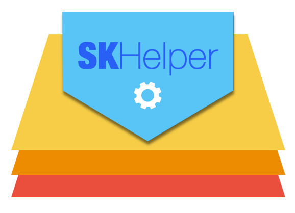

---

# SKHelper

- [SKHelper Documentation Landing Page](https://russell-archer.github.io/SKHelper/documentation/skhelper) - `SKHelper` documentation landing page
- [SKHelper Quick Start](https://russell-archer.github.io/SKHelper/documentation/skhelper/quickstart) - `SKHelper` quick-start guide 
- [SKHelper In-Depth Guide](https://russell-archer.github.io/SKHelper/documentation/skhelper/guide) - `SKHelper` and `StoreKit2` in-depth guide
- [SKHelper Demo Project](https://github.com/russell-archer/SKHelperDemo) - Example Xcode `SKHelper` project

---

# Recent Major Changes
- 5 Sep, 2024
    - `SKHelper` is now "feature complete" (apart from support for consumables)
- 5 Aug, 2024
    - First proof-of-concept public release of `SKHelper` on GitHub
    
---

## Overview of SKHelper

`SKHelper` is a Swift Package Manager (SPM) package that enables developers using **Xcode 16** to easily add in-app purchase 
support to **iOS 17+** and **macOS 14.6+** SwiftUI apps. 

`SKHelper` provides the following features:

- Multi-platform (iOS, macOS) SwiftUI support for purchasing **Consumable** (not yet implemented), **Non-consumable** and **Subscription** products
- Makes use of Apple's **StoreKit Views** to provide a standard and easily customizable UI
- Designed to be **lightweight**, simple and an easier-to-use refactoring of the `StoreHelper` package
- Detailed **documentation** and an example project
- Supports **transaction validation**, **pending ("ask to buy") transactions**, **cancelled** and **failed** transactions
- Supports customer **refunds** and management of **subscriptions** (not yet implemented)
- Provides detailed **transaction information and history** for non-consumables and subscriptions (not yet implemented)
- Support for direct App Store purchases of **promoted in-app purchases** via Purchase Intents
- Supports Xcode 16's "complete" **Strict Concurrency Checking** 

## License

MIT license, copyright (c) 2024 Russell Archer. This software is provided "as-is" without warranty and may be freely used, copied, 
modified and redistributed, including as part of commercial software. 

See [License](https://russell-archer.github.io/SKHelper/documentation/skhelper/license) for details.

## Requirements
`SKHelper` uses the newest features of Apple's `StoreKit2` and which requires **iOS 16.4+**, **macOS 14.6+** and **Xcode 16**.

## Getting Started

Jump to the [SKHelper Quick Start](https://russell-archer.github.io/SKHelper/documentation/skhelper/quickstart) guide.
